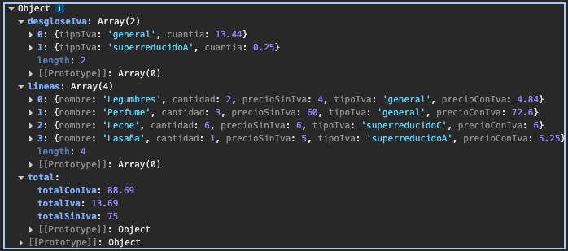

# Módulo 9 - Laboratorio 9.1 Ticket de Compra

Para poder visualizar el contenido de este Laboratorio.

Pasos:

- Clonate el proyecto.
- Instala las dependencias con `npm install`.
- Ejecuta el sandbox con `npm run dev`.
- Abre el navegador en `http://localhost:5173/` (si ese puerto no te funciona, mira en la consola donde has hecho el build, puede que este ocupado y se haya abierto en otro puerto).

## Organización y primeros pasos

Para realizar este proyecto se han creado varios archivos con el fin de tener el código mucho más ordenado y facilitar su lectura o cambios en caso de ser necesario:

- **model.ts** con las `interface` que conforman nuestro modelo.
- **constants.ts** con los productos que vamos a usar/introducir en el proyecto.
- **main.ts** donde indicamos que debemos mostrar por `consola` el resultado.
- **ticket.ts** con la _función principal_ que nos indica cómo mostrar el ticket. Es a la que llamamos en el main.ts.
- **ticket.helper.ts** _desglosamos las funciones_ a las que llamamos desde ticket. Paso a paso que nos ayuda a crear una función mayor.
- **ticket.helper.spec.ts** donde realizamos _pruebas_ unitarias para asegurarnos de que las funciones se ejecutan sin errores.
- **calculos-totales.ts** con las funciones que hacen referencia a _calculos de suma total_, por ejemplo el total con IVA o el total del ticket sin IVA.
- **calculos-totales.spec.ts** para las _pruebas_ unitarias de las funciones que calculan totales.

## Resultado

Así se muestra el resultado por consola:

